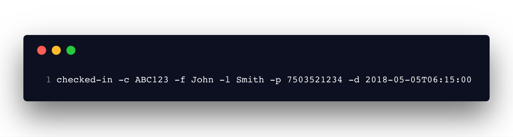

> ### Schedule your flight check-ins from the comfort of your command line

## What is this?

This is a small CLI tool that helps you schedule and check into your flights
(Southwest) in advance. Besides paying for Business Select or an EarlyBird Check
In fare Southwest Airlines determines your boarding position based on the time
you check-in. This is a way to set and forget about checking-in, you will always
be first in line and get that window or aisle spot!

## Getting Started

In order to use checked-in make sure that you have Node v7.6.0 or greater

`npm install -g checked-in`

# Options

`-c <confirmationNumber>` or `--confirmationNumber <confirmationNumber>` 
 
`-d <date>` or `--date <date>` (Currently needs to be a ISO 8601 string)
 
`-l <lastName>` or `--lastName <lastName>`
 
`-f <firstName>` or `--firstName <firstName>`
 
`-p <phone>` or `--phoneNumber <phone>`

### Example Usage

